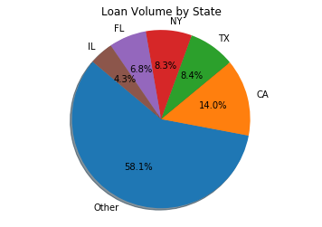
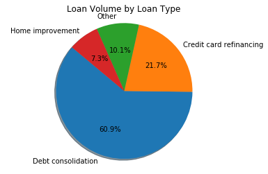
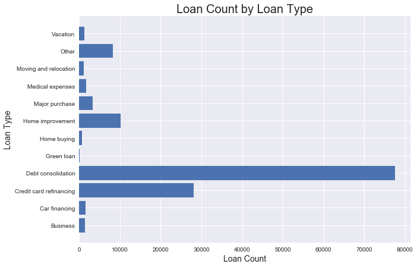
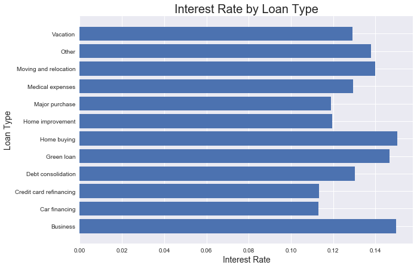
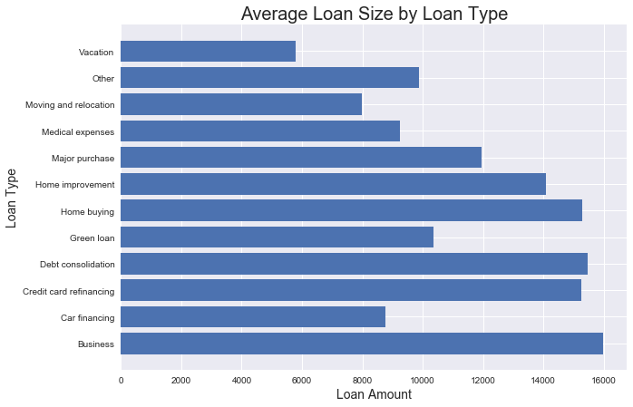
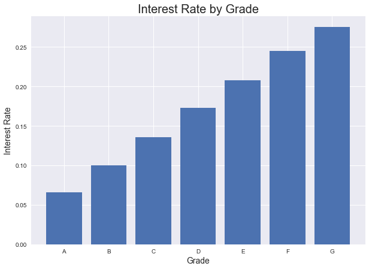
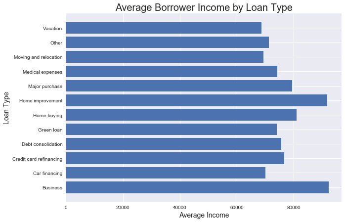
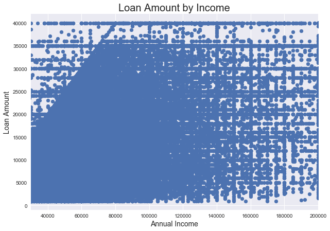
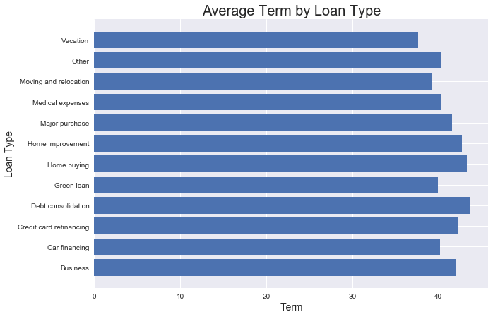

```python
# Dependencies
import matplotlib.pyplot as plt
import numpy as np
import pandas as pd
import seaborn as sns
```


```python
print("Observations:")
print("1. California, Texas, New York, Florida and Illinois generate the most loan volume while all other states generate less than 4% each, but more than 58% combined.")
print("2. Almost 90% of the loan volume is from debt consolidation, credit card refinancing and home improvement loans.")
print("3. The highest rate is charged on business loans.")
print("4. The largest loans are business loans, debt consolidation, and credit card refinancing loans in decending order.")
print("5. The loans are graded A-F, with A costing the least in interest and F the most. The rate rises linearly with the letters.")
print("6. The lowest income borrowers borrow for vacations, while those with the highest income borrow to invest in businesses.")
print("7. The amount borrowed starts at about $15k for annual income level $30k, rising linearly to $40k for incomes above $80k.")
print("8. The longest term loans are for debt consolidation and home buying.")
```

    Observations:
    1. California, Texas, New York, Florida and Illinois generate the most loan volume while all other states generate less than 4% each, but more than 58% combined.
    2. Almost 90% of the loan volume is from debt consolidation, credit card refinancing and home improvement loans.
    3. The highest rate is charged on business loans.
    4. The largest loans are business loans, debt consolidation, and credit card refinancing loans in decending order.
    5. The loans are graded A-F, with A costing the least in interest and F the most. The rate rises linearly with the letters.
    6. The lowest income borrowers borrow for vacations, while those with the highest income borrow to invest in businesses.
    7. The amount borrowed starts at about $15k for annual income level $30k, rising linearly to $40k for incomes above $80k.
    8. The longest term loans are for debt consolidation and home buying.
    


```python
# Read CSV
LoanStats_df = pd.read_csv("LoanStatsJune.csv")
#LoanStats_df.head()
#type(LoanStats_df)
#LoanStats_df.dtypes
LoanStats_df.shape
#LoanStats_df.columns
```


    (134980, 15)


```python
VolumeByStateL1_df = LoanStats_df[["addr_state","loan_amnt"]]
VolumeByStateL2_df = VolumeByStateL1_df.groupby("addr_state").sum().reset_index()
#VolumeByStateL2_df
```


```python
TotalVolume = VolumeByStateL2_df["loan_amnt"].sum()
VolumeByStateL2_df["Proportion"]= VolumeByStateL2_df["loan_amnt"]/TotalVolume

#df['New Value'] = np.where(df['E'] == 'ABC', df['C'], df['E'])
VolumeByStateL2_df["State"]=np.where(VolumeByStateL2_df["Proportion"]>0.04,VolumeByStateL2_df["addr_state"],"Other")
VolumeByStateL3_df = VolumeByStateL2_df[["State","loan_amnt"]]
VolumeByStateL4_df = VolumeByStateL3_df.groupby("State").sum().reset_index()
#VolumeByStateL4_df
```


```python
VolumeByStateL4_df.sort_values(by=["loan_amnt"], axis=0, ascending=False, inplace=True, kind='quicksort', na_position='last')
VolumeByStateL4_df
```


<div>
<style>
    .dataframe thead tr:only-child th {
        text-align: right;
    }

    .dataframe thead th {
        text-align: left;
    }

    .dataframe tbody tr th {
        vertical-align: top;
    }
</style>
<table border="1" class="dataframe">
  <thead>
    <tr style="text-align: right;">
      <th></th>
      <th>State</th>
      <th>loan_amnt</th>
    </tr>
  </thead>
  <tbody>
    <tr>
      <th>4</th>
      <td>Other</td>
      <td>1145389200</td>
    </tr>
    <tr>
      <th>0</th>
      <td>CA</td>
      <td>275164325</td>
    </tr>
    <tr>
      <th>5</th>
      <td>TX</td>
      <td>165884950</td>
    </tr>
    <tr>
      <th>3</th>
      <td>NY</td>
      <td>164415375</td>
    </tr>
    <tr>
      <th>1</th>
      <td>FL</td>
      <td>133824175</td>
    </tr>
    <tr>
      <th>2</th>
      <td>IL</td>
      <td>85311175</td>
    </tr>
  </tbody>
</table>
</div>


```python
plt.title("Loan Volume by State")

# Labels for the sections of our pie chart
labels = VolumeByStateL4_df["State"]

# The values of each section of the pie chart
sizes = VolumeByStateL4_df["loan_amnt"]

# The colors of each section of the pie chart
#colors = TotalFaresbyCityTypeL3_df["Color"]

```


```python
# Creates the pie chart based upon the values above
# Automatically finds the percentages of each part of the pie chart
plt.pie(x=sizes, labels=labels, autopct="%1.1f%%", shadow=True, startangle=140)
```


    ([<matplotlib.patches.Wedge at 0x215322381d0>,
      <matplotlib.patches.Wedge at 0x21532238ba8>,
      <matplotlib.patches.Wedge at 0x21532248550>,
      <matplotlib.patches.Wedge at 0x21532248fd0>,
      <matplotlib.patches.Wedge at 0x21532251a90>,
      <matplotlib.patches.Wedge at 0x21532258550>],
     [Text(-0.470867,-0.994125,'Other'),
      Text(1.06519,0.274543,'CA'),
      Text(0.634827,0.898328,'TX'),
      Text(0.0971728,1.0957,'NY'),
      Text(-0.415312,1.01859,'FL'),
      Text(-0.738964,0.81482,'IL')],
     [Text(-0.256837,-0.54225,'58.1%'),
      Text(0.581012,0.149751,'14.0%'),
      Text(0.34627,0.489997,'8.4%'),
      Text(0.0530034,0.597654,'8.3%'),
      Text(-0.226534,0.555592,'6.8%'),
      Text(-0.403071,0.444447,'4.3%')])


```python
# Tells matplotlib that we want a pie chart with equal axes
plt.axis("equal")
```


    (-1.1105547211503075,
     1.1108600495382563,
     -1.1023789625881524,
     1.1041175595700408)


```python
# Prints our pie chart to the screen
plt.show()
```





```python
VolumeByTypeL1_df = LoanStats_df[["title","loan_amnt"]]
VolumeByTypeL2_df = VolumeByTypeL1_df.groupby("title").sum().reset_index()
VolumeByTypeL2_df["Type"]=VolumeByTypeL2_df["title"]
VolumeByTypeL2_df
```


<div>
<style>
    .dataframe thead tr:only-child th {
        text-align: right;
    }

    .dataframe thead th {
        text-align: left;
    }

    .dataframe tbody tr th {
        vertical-align: top;
    }
</style>
<table border="1" class="dataframe">
  <thead>
    <tr style="text-align: right;">
      <th></th>
      <th>title</th>
      <th>loan_amnt</th>
      <th>Type</th>
    </tr>
  </thead>
  <tbody>
    <tr>
      <th>0</th>
      <td>Business</td>
      <td>22655125</td>
      <td>Business</td>
    </tr>
    <tr>
      <th>1</th>
      <td>Car financing</td>
      <td>13715875</td>
      <td>Car financing</td>
    </tr>
    <tr>
      <th>2</th>
      <td>Credit card refinancing</td>
      <td>427936250</td>
      <td>Credit card refinancing</td>
    </tr>
    <tr>
      <th>3</th>
      <td>Debt consolidation</td>
      <td>1200169900</td>
      <td>Debt consolidation</td>
    </tr>
    <tr>
      <th>4</th>
      <td>Green loan</td>
      <td>942175</td>
      <td>Green loan</td>
    </tr>
    <tr>
      <th>5</th>
      <td>Home buying</td>
      <td>9420650</td>
      <td>Home buying</td>
    </tr>
    <tr>
      <th>6</th>
      <td>Home improvement</td>
      <td>143504500</td>
      <td>Home improvement</td>
    </tr>
    <tr>
      <th>7</th>
      <td>Major purchase</td>
      <td>38712150</td>
      <td>Major purchase</td>
    </tr>
    <tr>
      <th>8</th>
      <td>Medical expenses</td>
      <td>15173700</td>
      <td>Medical expenses</td>
    </tr>
    <tr>
      <th>9</th>
      <td>Moving and relocation</td>
      <td>8872000</td>
      <td>Moving and relocation</td>
    </tr>
    <tr>
      <th>10</th>
      <td>Other</td>
      <td>82007175</td>
      <td>Other</td>
    </tr>
    <tr>
      <th>11</th>
      <td>Vacation</td>
      <td>6914700</td>
      <td>Vacation</td>
    </tr>
  </tbody>
</table>
</div>


```python
TotalVolume = VolumeByTypeL2_df["loan_amnt"].sum()
VolumeByTypeL2_df["Proportion"]= VolumeByTypeL2_df["loan_amnt"]/TotalVolume

#df['New Value'] = np.where(df['E'] == 'ABC', df['C'], df['E'])
VolumeByTypeL2_df["Type"]=np.where(VolumeByTypeL2_df["Proportion"]>0.04,VolumeByTypeL2_df["title"],"Other")
VolumeByTypeL3_df = VolumeByTypeL2_df[["Type","loan_amnt"]]
VolumeByTypeL4_df = VolumeByTypeL3_df.groupby("Type").sum().reset_index()
VolumeByTypeL4_df
```


<div>
<style>
    .dataframe thead tr:only-child th {
        text-align: right;
    }

    .dataframe thead th {
        text-align: left;
    }

    .dataframe tbody tr th {
        vertical-align: top;
    }
</style>
<table border="1" class="dataframe">
  <thead>
    <tr style="text-align: right;">
      <th></th>
      <th>Type</th>
      <th>loan_amnt</th>
    </tr>
  </thead>
  <tbody>
    <tr>
      <th>0</th>
      <td>Credit card refinancing</td>
      <td>427936250</td>
    </tr>
    <tr>
      <th>1</th>
      <td>Debt consolidation</td>
      <td>1200169900</td>
    </tr>
    <tr>
      <th>2</th>
      <td>Home improvement</td>
      <td>143504500</td>
    </tr>
    <tr>
      <th>3</th>
      <td>Other</td>
      <td>198413550</td>
    </tr>
  </tbody>
</table>
</div>


```python
VolumeByTypeL4_df.sort_values(by=["loan_amnt"], axis=0, ascending=False, inplace=True, kind='quicksort', na_position='last')
VolumeByTypeL4_df
```


<div>
<style>
    .dataframe thead tr:only-child th {
        text-align: right;
    }

    .dataframe thead th {
        text-align: left;
    }

    .dataframe tbody tr th {
        vertical-align: top;
    }
</style>
<table border="1" class="dataframe">
  <thead>
    <tr style="text-align: right;">
      <th></th>
      <th>Type</th>
      <th>loan_amnt</th>
    </tr>
  </thead>
  <tbody>
    <tr>
      <th>1</th>
      <td>Debt consolidation</td>
      <td>1200169900</td>
    </tr>
    <tr>
      <th>0</th>
      <td>Credit card refinancing</td>
      <td>427936250</td>
    </tr>
    <tr>
      <th>3</th>
      <td>Other</td>
      <td>198413550</td>
    </tr>
    <tr>
      <th>2</th>
      <td>Home improvement</td>
      <td>143504500</td>
    </tr>
  </tbody>
</table>
</div>


```python
plt.title("Loan Volume by Loan Type")

# Labels for the sections of our pie chart
labels = VolumeByTypeL4_df["Type"]

# The values of each section of the pie chart
sizes = VolumeByTypeL4_df["loan_amnt"]

# The colors of each section of the pie chart
#colors = TotalFaresbyCityTypeL3_df["Color"]

```


```python
# Creates the pie chart based upon the values above
# Automatically finds the percentages of each part of the pie chart
plt.pie(x=sizes, labels=labels, autopct="%1.1f%%", shadow=True, startangle=140)
```


    ([<matplotlib.patches.Wedge at 0x215324110b8>,
      <matplotlib.patches.Wedge at 0x21532411c50>,
      <matplotlib.patches.Wedge at 0x21532419550>,
      <matplotlib.patches.Wedge at 0x21532419f60>],
     [Text(-0.38237,-1.0314,'Debt consolidation'),
      Text(0.861848,0.683533,'Credit card refinancing'),
      Text(-0.108243,1.09466,'Other'),
      Text(-0.660279,0.879791,'Home improvement')],
     [Text(-0.208566,-0.562584,'60.9%'),
      Text(0.470099,0.372836,'21.7%'),
      Text(-0.0590417,0.597088,'10.1%'),
      Text(-0.360152,0.479886,'7.3%')])


```python
# Tells matplotlib that we want a pie chart with equal axes
plt.axis("equal")
```


    (-1.1115675350746805,
     1.1033416453882836,
     -1.1130059742242522,
     1.1064302613756116)


```python
# Prints our pie chart to the screen
plt.show()
```





```python
LoanCountByLoanTypeL1_df = LoanStats_df[["title","loan_amnt"]]
LoanCountByLoanTypeL2_df = LoanCountByLoanTypeL1_df.groupby("title").count().reset_index()
LoanCountByLoanTypeL2_df = LoanCountByLoanTypeL2_df.rename(columns = {'loan_amnt':'Count'})
LoanCountByLoanTypeL2_df
```


<div>
<style>
    .dataframe thead tr:only-child th {
        text-align: right;
    }

    .dataframe thead th {
        text-align: left;
    }

    .dataframe tbody tr th {
        vertical-align: top;
    }
</style>
<table border="1" class="dataframe">
  <thead>
    <tr style="text-align: right;">
      <th></th>
      <th>title</th>
      <th>Count</th>
    </tr>
  </thead>
  <tbody>
    <tr>
      <th>0</th>
      <td>Business</td>
      <td>1418</td>
    </tr>
    <tr>
      <th>1</th>
      <td>Car financing</td>
      <td>1564</td>
    </tr>
    <tr>
      <th>2</th>
      <td>Credit card refinancing</td>
      <td>28071</td>
    </tr>
    <tr>
      <th>3</th>
      <td>Debt consolidation</td>
      <td>77557</td>
    </tr>
    <tr>
      <th>4</th>
      <td>Green loan</td>
      <td>91</td>
    </tr>
    <tr>
      <th>5</th>
      <td>Home buying</td>
      <td>616</td>
    </tr>
    <tr>
      <th>6</th>
      <td>Home improvement</td>
      <td>10191</td>
    </tr>
    <tr>
      <th>7</th>
      <td>Major purchase</td>
      <td>3235</td>
    </tr>
    <tr>
      <th>8</th>
      <td>Medical expenses</td>
      <td>1640</td>
    </tr>
    <tr>
      <th>9</th>
      <td>Moving and relocation</td>
      <td>1113</td>
    </tr>
    <tr>
      <th>10</th>
      <td>Other</td>
      <td>8291</td>
    </tr>
    <tr>
      <th>11</th>
      <td>Vacation</td>
      <td>1193</td>
    </tr>
  </tbody>
</table>
</div>


```python
x=LoanCountByLoanTypeL2_df["title"]
y=LoanCountByLoanTypeL2_df["Count"]

plt.figure(figsize=(10,7))
sns.set()
plt.grid(True)
plt.barh(x,y)
plt.title("Loan Count by Loan Type", fontsize =20)
plt.xlabel("Loan Count", fontsize=14)
plt.ylabel("Loan Type", fontsize=14)
#plt.xlim(1,100)
#plt.ylim(-1,1)
plt.show()
```





```python
RateByLoanTypeL1_df = LoanStats_df[["title","int_rate"]]
RateByLoanTypeL2_df = RateByLoanTypeL1_df.groupby("title").mean().reset_index()
RateByLoanTypeL2_df.dtypes
```


    title        object
    int_rate    float64
    dtype: object


```python
RateByLoanTypeL2_df.sort_values(by=["int_rate"], axis=0, ascending=False, inplace=True, kind='quicksort', na_position='last')
RateByLoanTypeL2_df
```


<div>
<style>
    .dataframe thead tr:only-child th {
        text-align: right;
    }

    .dataframe thead th {
        text-align: left;
    }

    .dataframe tbody tr th {
        vertical-align: top;
    }
</style>
<table border="1" class="dataframe">
  <thead>
    <tr style="text-align: right;">
      <th></th>
      <th>title</th>
      <th>int_rate</th>
    </tr>
  </thead>
  <tbody>
    <tr>
      <th>5</th>
      <td>Home buying</td>
      <td>0.150357</td>
    </tr>
    <tr>
      <th>0</th>
      <td>Business</td>
      <td>0.149690</td>
    </tr>
    <tr>
      <th>4</th>
      <td>Green loan</td>
      <td>0.146813</td>
    </tr>
    <tr>
      <th>9</th>
      <td>Moving and relocation</td>
      <td>0.139829</td>
    </tr>
    <tr>
      <th>10</th>
      <td>Other</td>
      <td>0.137913</td>
    </tr>
    <tr>
      <th>3</th>
      <td>Debt consolidation</td>
      <td>0.130221</td>
    </tr>
    <tr>
      <th>8</th>
      <td>Medical expenses</td>
      <td>0.129378</td>
    </tr>
    <tr>
      <th>11</th>
      <td>Vacation</td>
      <td>0.129162</td>
    </tr>
    <tr>
      <th>6</th>
      <td>Home improvement</td>
      <td>0.119502</td>
    </tr>
    <tr>
      <th>7</th>
      <td>Major purchase</td>
      <td>0.118884</td>
    </tr>
    <tr>
      <th>2</th>
      <td>Credit card refinancing</td>
      <td>0.113235</td>
    </tr>
    <tr>
      <th>1</th>
      <td>Car financing</td>
      <td>0.113101</td>
    </tr>
  </tbody>
</table>
</div>


```python
x=RateByLoanTypeL2_df["title"]
y=RateByLoanTypeL2_df["int_rate"]

plt.figure(figsize=(10,7))
sns.set()
plt.grid(True)
plt.barh(x,y)
plt.title("Interest Rate by Loan Type", fontsize =20)
plt.xlabel("Interest Rate", fontsize=14)
plt.ylabel("Loan Type", fontsize=14)
#plt.xlim(1,100)
#plt.ylim(-1,1)
plt.show()
```





```python
LoanSizeByLoanTypeL1_df = LoanStats_df[["title","loan_amnt"]]
LoanSizeByLoanTypeL2_df = LoanSizeByLoanTypeL1_df.groupby("title").mean().reset_index()
LoanSizeByLoanTypeL2_df
```


<div>
<style>
    .dataframe thead tr:only-child th {
        text-align: right;
    }

    .dataframe thead th {
        text-align: left;
    }

    .dataframe tbody tr th {
        vertical-align: top;
    }
</style>
<table border="1" class="dataframe">
  <thead>
    <tr style="text-align: right;">
      <th></th>
      <th>title</th>
      <th>loan_amnt</th>
    </tr>
  </thead>
  <tbody>
    <tr>
      <th>0</th>
      <td>Business</td>
      <td>15976.815938</td>
    </tr>
    <tr>
      <th>1</th>
      <td>Car financing</td>
      <td>8769.741049</td>
    </tr>
    <tr>
      <th>2</th>
      <td>Credit card refinancing</td>
      <td>15244.781091</td>
    </tr>
    <tr>
      <th>3</th>
      <td>Debt consolidation</td>
      <td>15474.681847</td>
    </tr>
    <tr>
      <th>4</th>
      <td>Green loan</td>
      <td>10353.571429</td>
    </tr>
    <tr>
      <th>5</th>
      <td>Home buying</td>
      <td>15293.262987</td>
    </tr>
    <tr>
      <th>6</th>
      <td>Home improvement</td>
      <td>14081.493475</td>
    </tr>
    <tr>
      <th>7</th>
      <td>Major purchase</td>
      <td>11966.661515</td>
    </tr>
    <tr>
      <th>8</th>
      <td>Medical expenses</td>
      <td>9252.256098</td>
    </tr>
    <tr>
      <th>9</th>
      <td>Moving and relocation</td>
      <td>7971.248877</td>
    </tr>
    <tr>
      <th>10</th>
      <td>Other</td>
      <td>9891.107828</td>
    </tr>
    <tr>
      <th>11</th>
      <td>Vacation</td>
      <td>5796.060352</td>
    </tr>
  </tbody>
</table>
</div>


```python
x=LoanSizeByLoanTypeL2_df["title"]
y=LoanSizeByLoanTypeL2_df["loan_amnt"]

plt.figure(figsize=(10,7))
sns.set()
plt.grid(True)
plt.barh(x,y)
plt.title("Average Loan Size by Loan Type", fontsize =20)
plt.xlabel("Loan Amount", fontsize=14)
plt.ylabel("Loan Type", fontsize=14)
#plt.xlim(1,100)
#plt.ylim(-1,1)
plt.show()
```





```python
RateByGradeL1_df = LoanStats_df[["grade","int_rate"]]
RateByGradeL2_df = RateByGradeL1_df.groupby("grade").mean().reset_index()
RateByGradeL2_df
```


<div>
<style>
    .dataframe thead tr:only-child th {
        text-align: right;
    }

    .dataframe thead th {
        text-align: left;
    }

    .dataframe tbody tr th {
        vertical-align: top;
    }
</style>
<table border="1" class="dataframe">
  <thead>
    <tr style="text-align: right;">
      <th></th>
      <th>grade</th>
      <th>int_rate</th>
    </tr>
  </thead>
  <tbody>
    <tr>
      <th>0</th>
      <td>A</td>
      <td>0.065871</td>
    </tr>
    <tr>
      <th>1</th>
      <td>B</td>
      <td>0.100135</td>
    </tr>
    <tr>
      <th>2</th>
      <td>C</td>
      <td>0.135670</td>
    </tr>
    <tr>
      <th>3</th>
      <td>D</td>
      <td>0.172667</td>
    </tr>
    <tr>
      <th>4</th>
      <td>E</td>
      <td>0.207444</td>
    </tr>
    <tr>
      <th>5</th>
      <td>F</td>
      <td>0.244924</td>
    </tr>
    <tr>
      <th>6</th>
      <td>G</td>
      <td>0.275067</td>
    </tr>
  </tbody>
</table>
</div>


```python
x=RateByGradeL2_df["grade"]
y=RateByGradeL2_df["int_rate"]

plt.figure(figsize=(10,7))
sns.set()
plt.grid(True)
plt.bar(x,y)
plt.title("Interest Rate by Grade", fontsize =20)
plt.xlabel("Grade", fontsize=14)
plt.ylabel("Interest Rate", fontsize=14)
#plt.xlim(1,100)
#plt.ylim(-1,1)
plt.show()
```





```python
LoanTypeByincomeL1_df = LoanStats_df[["title","annual_inc"]]
LoanTypeByincomeL2_df = LoanTypeByincomeL1_df.groupby("title").mean().reset_index()
LoanTypeByincomeL2_df
```


<div>
<style>
    .dataframe thead tr:only-child th {
        text-align: right;
    }

    .dataframe thead th {
        text-align: left;
    }

    .dataframe tbody tr th {
        vertical-align: top;
    }
</style>
<table border="1" class="dataframe">
  <thead>
    <tr style="text-align: right;">
      <th></th>
      <th>title</th>
      <th>annual_inc</th>
    </tr>
  </thead>
  <tbody>
    <tr>
      <th>0</th>
      <td>Business</td>
      <td>92246.861072</td>
    </tr>
    <tr>
      <th>1</th>
      <td>Car financing</td>
      <td>70096.852302</td>
    </tr>
    <tr>
      <th>2</th>
      <td>Credit card refinancing</td>
      <td>76728.572049</td>
    </tr>
    <tr>
      <th>3</th>
      <td>Debt consolidation</td>
      <td>75554.755973</td>
    </tr>
    <tr>
      <th>4</th>
      <td>Green loan</td>
      <td>74115.175824</td>
    </tr>
    <tr>
      <th>5</th>
      <td>Home buying</td>
      <td>80947.612013</td>
    </tr>
    <tr>
      <th>6</th>
      <td>Home improvement</td>
      <td>91797.297125</td>
    </tr>
    <tr>
      <th>7</th>
      <td>Major purchase</td>
      <td>79386.724266</td>
    </tr>
    <tr>
      <th>8</th>
      <td>Medical expenses</td>
      <td>74222.316463</td>
    </tr>
    <tr>
      <th>9</th>
      <td>Moving and relocation</td>
      <td>69433.835580</td>
    </tr>
    <tr>
      <th>10</th>
      <td>Other</td>
      <td>71212.547889</td>
    </tr>
    <tr>
      <th>11</th>
      <td>Vacation</td>
      <td>68746.119866</td>
    </tr>
  </tbody>
</table>
</div>


```python
x=LoanTypeByincomeL2_df["title"]
y=LoanTypeByincomeL2_df["annual_inc"]

plt.figure(figsize=(10,7))
sns.set()
plt.grid(True)
plt.barh(x,y)
plt.title("Average Borrower Income by Loan Type", fontsize =20)
plt.xlabel("Average Income", fontsize=14)
plt.ylabel("Loan Type", fontsize=14)
#plt.xlim(1,100)
#plt.ylim(-1,1)
plt.show()
```





```python
LoanAmountByIncome_df = LoanStats_df[["annual_inc","loan_amnt"]]
LoanAmountByIncome_df.head()
```


<div>
<style>
    .dataframe thead tr:only-child th {
        text-align: right;
    }

    .dataframe thead th {
        text-align: left;
    }

    .dataframe tbody tr th {
        vertical-align: top;
    }
</style>
<table border="1" class="dataframe">
  <thead>
    <tr style="text-align: right;">
      <th></th>
      <th>annual_inc</th>
      <th>loan_amnt</th>
    </tr>
  </thead>
  <tbody>
    <tr>
      <th>0</th>
      <td>62000.0</td>
      <td>6000</td>
    </tr>
    <tr>
      <th>1</th>
      <td>51000.0</td>
      <td>19200</td>
    </tr>
    <tr>
      <th>2</th>
      <td>84000.0</td>
      <td>19000</td>
    </tr>
    <tr>
      <th>3</th>
      <td>27000.0</td>
      <td>5400</td>
    </tr>
    <tr>
      <th>4</th>
      <td>107000.0</td>
      <td>21000</td>
    </tr>
  </tbody>
</table>
</div>


```python
x=LoanAmountByIncome_df["annual_inc"]
y=LoanAmountByIncome_df["loan_amnt"]

plt.figure(figsize=(10,7))
sns.set()
plt.grid(True)
plt.scatter(x,y)
plt.title("Loan Amount by Income", fontsize =20)
plt.xlabel("Annual Income", fontsize=14)
plt.ylabel("Loan Amount", fontsize=14)
plt.xlim(30000,200000)
#plt.ylim(-1,1)
plt.show()
```





```python
TermByLoanTypeL1_df = LoanStats_df[["title","term"]]
TermByLoanTypeL1_df.head()
```


<div>
<style>
    .dataframe thead tr:only-child th {
        text-align: right;
    }

    .dataframe thead th {
        text-align: left;
    }

    .dataframe tbody tr th {
        vertical-align: top;
    }
</style>
<table border="1" class="dataframe">
  <thead>
    <tr style="text-align: right;">
      <th></th>
      <th>title</th>
      <th>term</th>
    </tr>
  </thead>
  <tbody>
    <tr>
      <th>0</th>
      <td>Debt consolidation</td>
      <td>36 months</td>
    </tr>
    <tr>
      <th>1</th>
      <td>Debt consolidation</td>
      <td>60 months</td>
    </tr>
    <tr>
      <th>2</th>
      <td>Debt consolidation</td>
      <td>36 months</td>
    </tr>
    <tr>
      <th>3</th>
      <td>Moving and relocation</td>
      <td>36 months</td>
    </tr>
    <tr>
      <th>4</th>
      <td>Debt consolidation</td>
      <td>60 months</td>
    </tr>
  </tbody>
</table>
</div>


```python
TermByLoanTypeL2_df = pd.DataFrame()
TermByLoanTypeL2_df["Title"] = LoanStats_df["title"]
TermByLoanTypeL2_df["Term"] = TermByLoanTypeL1_df["term"].str.extract('(\d\d)', expand=True)
TermByLoanTypeL2_df['Term'] = pd.to_numeric(TermByLoanTypeL2_df['Term'])
TermByLoanTypeL2_df.head()
```


<div>
<style>
    .dataframe thead tr:only-child th {
        text-align: right;
    }

    .dataframe thead th {
        text-align: left;
    }

    .dataframe tbody tr th {
        vertical-align: top;
    }
</style>
<table border="1" class="dataframe">
  <thead>
    <tr style="text-align: right;">
      <th></th>
      <th>Title</th>
      <th>Term</th>
    </tr>
  </thead>
  <tbody>
    <tr>
      <th>0</th>
      <td>Debt consolidation</td>
      <td>36</td>
    </tr>
    <tr>
      <th>1</th>
      <td>Debt consolidation</td>
      <td>60</td>
    </tr>
    <tr>
      <th>2</th>
      <td>Debt consolidation</td>
      <td>36</td>
    </tr>
    <tr>
      <th>3</th>
      <td>Moving and relocation</td>
      <td>36</td>
    </tr>
    <tr>
      <th>4</th>
      <td>Debt consolidation</td>
      <td>60</td>
    </tr>
  </tbody>
</table>
</div>


```python
TermByLoanTypeL2_df.dtypes
TermByLoanTypeL2_df = TermByLoanTypeL2_df.groupby("Title").mean().reset_index()
TermByLoanTypeL2_df
```


<div>
<style>
    .dataframe thead tr:only-child th {
        text-align: right;
    }

    .dataframe thead th {
        text-align: left;
    }

    .dataframe tbody tr th {
        vertical-align: top;
    }
</style>
<table border="1" class="dataframe">
  <thead>
    <tr style="text-align: right;">
      <th></th>
      <th>Title</th>
      <th>Term</th>
    </tr>
  </thead>
  <tbody>
    <tr>
      <th>0</th>
      <td>Business</td>
      <td>42.076164</td>
    </tr>
    <tr>
      <th>1</th>
      <td>Car financing</td>
      <td>40.143223</td>
    </tr>
    <tr>
      <th>2</th>
      <td>Credit card refinancing</td>
      <td>42.308005</td>
    </tr>
    <tr>
      <th>3</th>
      <td>Debt consolidation</td>
      <td>43.612775</td>
    </tr>
    <tr>
      <th>4</th>
      <td>Green loan</td>
      <td>39.956044</td>
    </tr>
    <tr>
      <th>5</th>
      <td>Home buying</td>
      <td>43.285714</td>
    </tr>
    <tr>
      <th>6</th>
      <td>Home improvement</td>
      <td>42.709450</td>
    </tr>
    <tr>
      <th>7</th>
      <td>Major purchase</td>
      <td>41.586399</td>
    </tr>
    <tr>
      <th>8</th>
      <td>Medical expenses</td>
      <td>40.302439</td>
    </tr>
    <tr>
      <th>9</th>
      <td>Moving and relocation</td>
      <td>39.212938</td>
    </tr>
    <tr>
      <th>10</th>
      <td>Other</td>
      <td>40.220480</td>
    </tr>
    <tr>
      <th>11</th>
      <td>Vacation</td>
      <td>37.669740</td>
    </tr>
  </tbody>
</table>
</div>


```python
x=TermByLoanTypeL2_df["Title"]
y=TermByLoanTypeL2_df["Term"]

plt.figure(figsize=(10,7))
sns.set()
plt.grid(True)
plt.barh(x,y)
plt.title("Average Term by Loan Type", fontsize =20)
plt.xlabel("Term", fontsize=14)
plt.ylabel("Loan Type", fontsize=14)
#plt.xlim(1,100)
#plt.ylim(-1,1)
plt.show()
```




